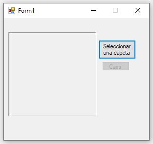
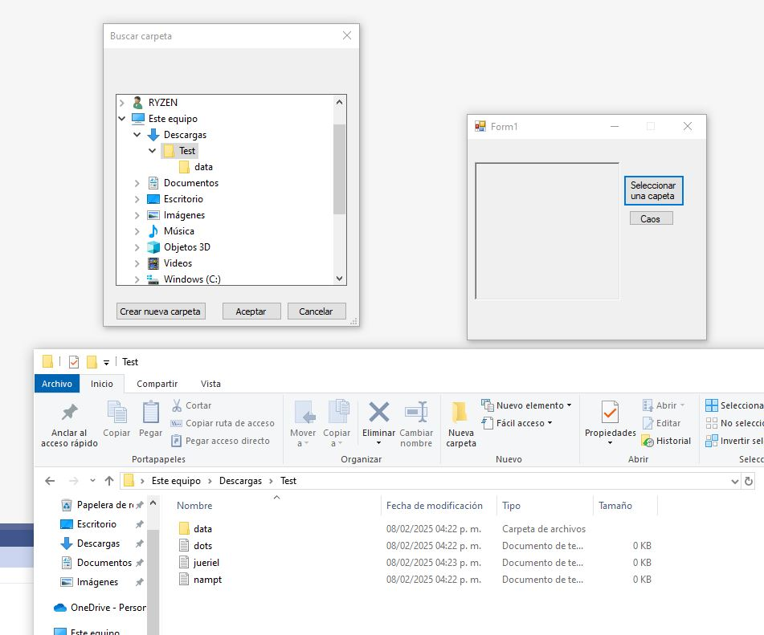
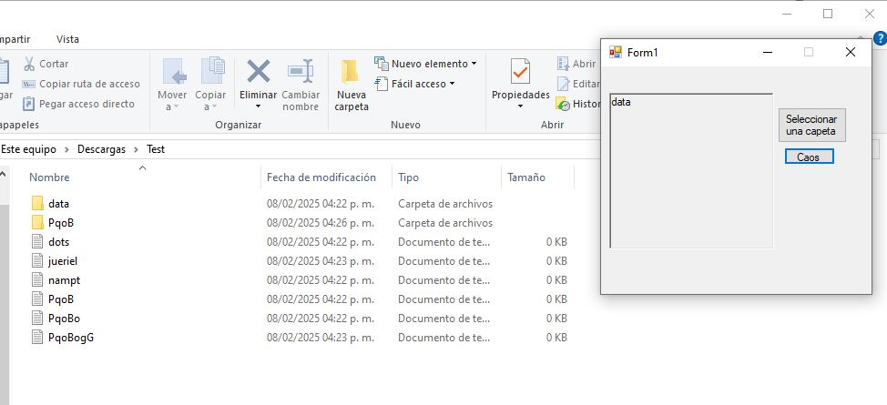

# RandomRenamer

Este proyecto es una aplicación de Windows Forms que permite seleccionar una carpeta y realizar operaciones de renombrado de archivos y directorios dentro de ella.

## Descripción

La aplicación permite al usuario seleccionar una carpeta y luego renombrar los archivos y directorios dentro de esa carpeta con nombres aleatorios. También muestra los nombres originales de los directorios en un `RichTextBox`.

## Características

- Selección de carpeta
- Renombrado de archivos y directorios con nombres aleatorios
- Visualización de nombres originales de directorios

## Capturas de Pantalla

### Pantalla Principal

### Selección de Carpeta

### Resultado del Renombrado

## Uso

1. Ejecuta la aplicación.
2. Haz clic en el botón "Seleccionar una carpeta" para elegir la carpeta que deseas procesar.
3. Una vez seleccionada la carpeta, el botón "Caos" se habilitará.
4. Haz clic en el botón "Caos" para renombrar los archivos y directorios dentro de la carpeta seleccionada.
5. Los nombres originales de los directorios se mostrarán en el `RichTextBox`.

## Requisitos

- .NET Framework 4.7.2

## Instalación

1. Clona este repositorio.
2. Abre el archivo de solución `Práctica 02.sln` en Visual Studio.
3. Compila y ejecuta el proyecto.

## Estructura del Proyecto

- `Form1.cs`: Contiene la lógica principal de la aplicación.
- `Form1.Designer.cs`: Contiene el diseño de la interfaz de usuario.
- `Program.cs`: Punto de entrada de la aplicación.
- `Properties/`: Contiene archivos de configuración y recursos del proyecto.

## Contribuciones

Las contribuciones son bienvenidas. Por favor, abre un issue o un pull request para discutir cualquier cambio que desees realizar.

## Licencia

Este proyecto está licenciado bajo la Licencia MIT. Consulta el archivo [LICENSE](LICENSE) para más detalles.